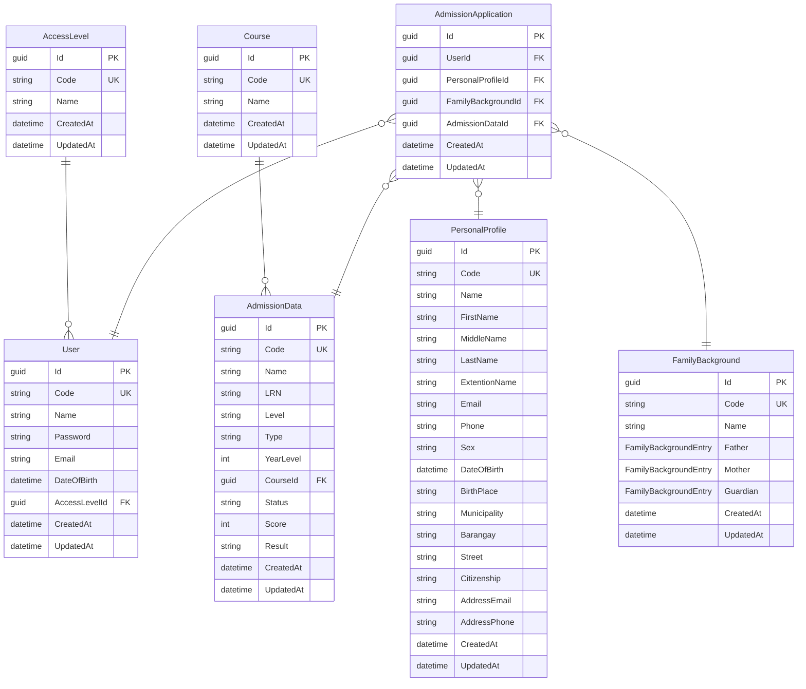

# Admission System — Database & GraphQL Schema Reference

---

## Entity-Relationship Diagram



---

## Table Definitions

### AccessLevel

| Field | C# Type | SQL Type | Max Len | Nullable | Notes |
|---|---|---|---|---|---|
| Id | `Guid` | TEXT | — | No | PK |
| Code | `string` | TEXT | 50 | No | Unique |
| Name | `string` | TEXT | 200 | No | |
| CreatedAt | `DateTime` | TEXT | — | No | ISO 8601 |
| UpdatedAt | `DateTime` | TEXT | — | No | ISO 8601 |

### Course

| Field | C# Type | SQL Type | Max Len | Nullable | Notes |
|---|---|---|---|---|---|
| Id | `Guid` | TEXT | — | No | PK |
| Code | `string` | TEXT | 50 | No | Unique |
| Name | `string` | TEXT | 200 | No | |
| CreatedAt | `DateTime` | TEXT | — | No | ISO 8601 |
| UpdatedAt | `DateTime` | TEXT | — | No | ISO 8601 |

### User

| Field | C# Type | SQL Type | Max Len | Nullable | Notes |
|---|---|---|---|---|---|
| Id | `Guid` | TEXT | — | No | PK |
| Code | `string` | TEXT | 50 | No | Unique |
| Name | `string` | TEXT | 200 | No | |
| Password | `string` | TEXT | — | No | |
| Email | `string` | TEXT | 200 | No | |
| DateOfBirth | `DateTime` | TEXT | — | No | ISO 8601 |
| AccessLevelId | `Guid` | TEXT | — | No | FK → AccessLevel.Id |
| CreatedAt | `DateTime` | TEXT | — | No | ISO 8601 |
| UpdatedAt | `DateTime` | TEXT | — | No | ISO 8601 |

### PersonalProfile

| Field | C# Type | SQL Type | Max Len | Nullable | Notes |
|---|---|---|---|---|---|
| Id | `Guid` | TEXT | — | No | PK |
| Code | `string` | TEXT | 50 | No | Unique |
| Name | `string` | TEXT | — | No | Full name (pre-computed) |
| FirstName | `string` | TEXT | 100 | No | |
| MiddleName | `string` | TEXT | 100 | No | |
| LastName | `string` | TEXT | 100 | No | |
| ExtentionName | `string` | TEXT | 50 | No | e.g. Jr., III |
| Email | `string` | TEXT | 200 | No | |
| Phone | `string` | TEXT | 20 | No | |
| Sex | `string` | TEXT | 10 | No | |
| DateOfBirth | `DateTime` | TEXT | — | No | ISO 8601 |
| BirthPlace | `string` | TEXT | 500 | No | |
| Municipality | `string` | TEXT | 200 | No | |
| Barangay | `string` | TEXT | 200 | No | |
| Street | `string` | TEXT | 200 | No | |
| Citizenship | `string` | TEXT | 100 | No | |
| AddressEmail | `string` | TEXT | 200 | No | |
| AddressPhone | `string` | TEXT | 20 | No | |
| CreatedAt | `DateTime` | TEXT | — | No | ISO 8601 |
| UpdatedAt | `DateTime` | TEXT | — | No | ISO 8601 |

### FamilyBackground

| Field | C# Type | SQL Type | Max Len | Nullable | Notes |
|---|---|---|---|---|---|
| Id | `Guid` | TEXT | — | No | PK |
| Code | `string` | TEXT | 50 | No | Unique |
| Name | `string` | TEXT | — | No | |
| Father | `FamilyBackgroundEntry` | — | — | No | Owned embedded type |
| Mother | `FamilyBackgroundEntry` | — | — | No | Owned embedded type |
| Guardian | `FamilyBackgroundEntry` | — | — | No | Owned embedded type |
| CreatedAt | `DateTime` | TEXT | — | No | ISO 8601 |
| UpdatedAt | `DateTime` | TEXT | — | No | ISO 8601 |

#### FamilyBackgroundEntry (Owned Value Object)

Stored as columns within the `FamilyBackground` table, prefixed by the property name (e.g. `Father_LastName`, `Mother_LastName`).

| Field | C# Type | Max Len | Nullable |
|---|---|---|---|
| LastName | `string` | 100 | No |
| FirstName | `string` | 100 | No |
| MiddleName | `string` | 100 | No |
| Phone | `string` | 20 | No |
| Occupation | `string` | 200 | No |
| AnualIncome | `string` | 50 | No |

### AdmissionData

| Field | C# Type | SQL Type | Max Len | Nullable | Notes |
|---|---|---|---|---|---|
| Id | `Guid` | TEXT | — | No | PK |
| Code | `string` | TEXT | 50 | No | Unique |
| Name | `string` | TEXT | — | No | |
| LRN | `string` | TEXT | 20 | No | Learner Reference Number |
| Level | `string` | TEXT | 50 | No | e.g. "College", "SHS" |
| Type | `string` | TEXT | 50 | No | e.g. "New", "Transferee", "Returning" |
| YearLevel | `int` | INTEGER | — | No | e.g. 1, 2, 3, 4 |
| CourseId | `Guid` | TEXT | — | No | FK → Course.Id |
| Status | `string` | TEXT | 50 | No | Default: "Pending" |
| Score | `int` | INTEGER | — | No | |
| Result | `string?` | TEXT | 200 | Yes | Nullable |
| CreatedAt | `DateTime` | TEXT | — | No | ISO 8601 |
| UpdatedAt | `DateTime` | TEXT | — | No | ISO 8601 |

### AdmissionApplication

| Field | C# Type | SQL Type | Nullable | Notes |
|---|---|---|---|---|
| Id | `Guid` | TEXT | No | PK |
| UserId | `Guid` | TEXT | Yes | FK → User.Id |
| PersonalProfileId | `Guid` | TEXT | Yes | FK → PersonalProfile.Id |
| FamilyBackgroundId | `Guid` | TEXT | Yes | FK → FamilyBackground.Id |
| AdmissionDataId | `Guid` | TEXT | Yes | FK → AdmissionData.Id |
| CreatedAt | `DateTime` | TEXT | No | ISO 8601 |
| UpdatedAt | `DateTime` | TEXT | No | ISO 8601 |

---

## Relationship Summary

| From | To | Type | FK Field |
|---|---|---|---|
| User | AccessLevel | Many → 1 | `User.AccessLevelId` |
| AdmissionData | Course | Many → 1 | `AdmissionData.CourseId` |
| AdmissionApplication | User | Many → 1 | `AdmissionApplication.UserId` |
| AdmissionApplication | PersonalProfile | Many → 1 | `AdmissionApplication.PersonalProfileId` |
| AdmissionApplication | FamilyBackground | Many → 1 | `AdmissionApplication.FamilyBackgroundId` |
| AdmissionApplication | AdmissionData | Many → 1 | `AdmissionApplication.AdmissionDataId` |

All FKs are nullable on `AdmissionApplication` — sub-entities are created independently first, then attached to the application.

---

## GraphQL API

### Queries

| Query | Return Type | Description |
|---|---|---|
| `accessLevels` | `[AccessLevel!]!` | Supports filtering, sorting, projection |
| `courses` | `[Course!]!` | Supports filtering, sorting, projection |
| `users` | `[User!]!` | Supports filtering, sorting, projection |
| `personalProfiles` | `[PersonalProfile!]!` | Supports filtering, sorting, projection |
| `familyBackgrounds` | `[FamilyBackground!]!` | Supports filtering, sorting, projection |
| `admissionDataList` | `[AdmissionData!]!` | Supports filtering, sorting, projection |
| `admissionApplications` | `[AdmissionApplication!]!` | Supports filtering, sorting, projection |

All queries support `where`, `order`, `take`, `skip` via HotChocolate.

### Mutations

| Mutation | Input | Return Type | Description |
|---|---|---|---|
| `createAccessLevel` | `CreateAccessLevelInput!` | `AccessLevel!` | Create a new access level |
| `createCourse` | `CreateCourseInput!` | `Course!` | Create a new course |
| `createUser` | `CreateUserInput!` | `User!` | Create a new user |
| `createPersonalProfile` | `CreatePersonalProfileInput!` | `PersonalProfile!` | Create a personal profile |
| `createFamilyBackground` | `CreateFamilyBackgroundInput!` | `FamilyBackground!` | Create family background |
| `createAdmissionData` | `CreateAdmissionDataInput!` | `AdmissionData!` | Create admission data |
| `createAdmissionApplication` | `CreateAdmissionApplicationInput!` | `AdmissionApplication!` | Create an empty application shell |
| `attachPersonalProfile` | `AttachToApplicationInput!` | `AdmissionApplication!` | Attach a profile to an application |
| `attachFamilyBackground` | `AttachToApplicationInput!` | `AdmissionApplication!` | Attach family bg to an application |
| `attachAdmissionData` | `AttachToApplicationInput!` | `AdmissionApplication!` | Attach admission data to an application |
| `updateAdmissionStatus` | `UpdateAdmissionStatusInput!` | `AdmissionData!` | Update admission status/score/result |

### Input Types

```graphql
input CreateAccessLevelInput {
  code: String!
  name: String!
}

input CreateCourseInput {
  code: String!
  name: String!
}

input CreateUserInput {
  code: String!
  name: String!
  password: String!
  email: String!
  dateOfBirth: DateTime!
  accessLevelId: UUID!
}

input CreatePersonalProfileInput {
  code: String!
  name: String!
  firstName: String!
  middleName: String!
  lastName: String!
  extentionName: String!
  email: String!
  phone: String!
  sex: String!
  dateOfBirth: DateTime!
  birthPlace: String!
  municipality: String!
  barangay: String!
  street: String!
  citizenship: String!
  addressEmail: String!
  addressPhone: String!
}

input FamilyBackgroundEntryInput {
  lastName: String!
  firstName: String!
  middleName: String!
  phone: String!
  occupation: String!
  anualIncome: String!
}

input CreateFamilyBackgroundInput {
  code: String!
  name: String!
  father: FamilyBackgroundEntryInput!
  mother: FamilyBackgroundEntryInput!
  guardian: FamilyBackgroundEntryInput!
}

input CreateAdmissionDataInput {
  code: String!
  name: String!
  lrn: String!
  level: String!
  type: String!
  yearLevel: Int!
  courseId: UUID!
  score: Int!
}

input CreateAdmissionApplicationInput {
  code: String!
  name: String!
}

input AttachToApplicationInput {
  applicationId: UUID!
  entityId: UUID!
}

input UpdateAdmissionStatusInput {
  id: UUID!
  status: String!
  score: Int!
  result: String
}
```

### Auto-Generated GraphQL Types (Output)

These are auto-mapped from the model classes. Every field on the model is exposed in GraphQL unless annotated otherwise.

```graphql
type AccessLevel {
  id: UUID!
  code: String!
  name: String!
  createdAt: DateTime!
  updatedAt: DateTime!
}

type Course {
  id: UUID!
  code: String!
  name: String!
  createdAt: DateTime!
  updatedAt: DateTime!
}

type User {
  id: UUID!
  code: String!
  name: String!
  password: String!
  email: String!
  dateOfBirth: DateTime!
  accessLevel: AccessLevel!
  createdAt: DateTime!
  updatedAt: DateTime!
}

type PersonalProfile {
  id: UUID!
  code: String!
  name: String!
  firstName: String!
  middleName: String!
  lastName: String!
  extentionName: String!
  email: String!
  phone: String!
  sex: String!
  dateOfBirth: DateTime!
  birthPlace: String!
  municipality: String!
  barangay: String!
  street: String!
  citizenship: String!
  addressEmail: String!
  addressPhone: String!
  createdAt: DateTime!
  updatedAt: DateTime!
}

type FamilyBackgroundEntry {
  lastName: String!
  firstName: String!
  middleName: String!
  phone: String!
  occupation: String!
  anualIncome: String!
}

type FamilyBackground {
  id: UUID!
  code: String!
  name: String!
  father: FamilyBackgroundEntry!
  mother: FamilyBackgroundEntry!
  guardian: FamilyBackgroundEntry!
  createdAt: DateTime!
  updatedAt: DateTime!
}

type AdmissionData {
  id: UUID!
  code: String!
  name: String!
  lrn: String!
  level: String!
  type: String!
  yearLevel: Int!
  course: Course!
  status: String!
  score: Int!
  result: String
  createdAt: DateTime!
  updatedAt: DateTime!
}

type AdmissionApplication {
  id: UUID!
  user: User
  personalProfile: PersonalProfile
  familyBackground: FamilyBackground
  admissionData: AdmissionData
  createdAt: DateTime!
  updatedAt: DateTime!
}
```

---

## Typical Usage Flow (Frontend)

1. **Lookup data** — query `accessLevels` and `courses` for dropdowns
2. **Create sub-entities** — `createPersonalProfile`, `createFamilyBackground`, `createAdmissionData`, `createUser` (if needed)
3. **Create application** — `createAdmissionApplication` to get an application shell
4. **Attach sub-entities** — `attachPersonalProfile`, `attachFamilyBackground`, `attachAdmissionData` using the IDs from steps 2 and 3
5. **Update status** — `updateAdmissionStatus` to set admission result

---

## Tech Stack

| Component | Technology |
|---|---|
| API | .NET 10 / HotChocolate 16.5.1 (GraphQL) |
| Database | SQLite (via EF Core 10) |
| DB Provider | `Microsoft.EntityFrameworkCore.Sqlite` |
| Test Provider | `Microsoft.EntityFrameworkCore.InMemory` |
| Endpoint | `http://localhost:5071/graphql` |
